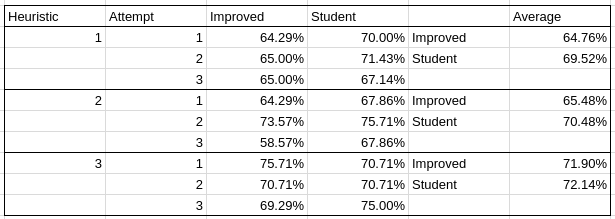

# Build a Game-playing Agent


## Synopsis

In this project, students will develop an adversarial search agent to play the game "Isolation".  Students only need to modify code in the `game_agent.py`, however, code is included for example player and evaluation functions for you to review and test against in the other files.

Isolation is a deterministic, two-player game of perfect information in which the players alternate turns moving a single piece from one cell to another on a board.  Whenever either player occupies a cell, that cell becomes blocked for the remainder of the game.  The first player with no remaining legal moves loses, and the opponent is declared the winner.

This project uses a version of Isolation where each agent is restricted to L-shaped movements (like a knight in chess) on a rectangular grid (like a chess or checkerboard).  The agents can move to any open cell on the board that is 2-rows and 1-column or 2-columns and 1-row away from their current position on the board. Movements are blocked at the edges of the board (the board does not wrap around), however, the player can "jump" blocked or occupied spaces (just like a knight in chess).

Additionally, agents will have a fixed time limit each turn to search for the best move and respond.  If the time limit expires during a player's turn, that player forfeits the match, and the opponent wins.

These rules are implemented in the `isolation.Board` class provided in the repository. 


## Quickstart Guide

The following example creates a game and illustrates the basic API. You can run this example with `python sample_players.py`

    from isolation import Board

    # create an isolation board (by default 7x7)
    player1 = RandomPlayer()
    player2 = GreedyPlayer()
    game = Board(player1, player2)

    # place player 1 on the board at row 2, column 3, then place player 2 on
    # the board at row 0, column 5; display the resulting board state.  Note
    # that .apply_move() changes the calling object
    game.apply_move((2, 3))
    game.apply_move((0, 5))
    print(game.to_string())

    # players take turns moving on the board, so player1 should be next to move
    assert(player1 == game.active_player)

    # get a list of the legal moves available to the active player
    print(game.get_legal_moves())

    # get a successor of the current state by making a copy of the board and
    # applying a move. Notice that this does NOT change the calling object
    # (unlike .apply_move()).
    new_game = game.forecast_move((1, 1))
    assert(new_game.to_string() != game.to_string())
    print("\nOld state:\n{}".format(game.to_string()))
    print("\nNew state:\n{}".format(new_game.to_string()))

    # play the remainder of the game automatically -- outcome can be "illegal
    # move" or "timeout"; it should _always_ be "illegal move" in this example
    winner, history, outcome = game.play()
    print("\nWinner: {}\nOutcome: {}".format(winner, outcome))
    print(game.to_string())
    print("Move history:\n{!s}".format(history))


## Instructions

Implement the following four functions in `game_agent.py`:

- `CustomPlayer.minimax()`: implement minimax search
- `CustomPlayer.alphabeta()`: implement minimax search with alpha-beta pruning
- `CustomPlayer.get_move()`: implement fixed-depth and iterative deepening search
- `custom_score()`: implement your own position evaluation heuristic

You may write or modify code within each file (as long as you maintain compatibility with the function signatures provided) and you may add other classes, functions, etc., as needed, but it is not required.  


### Coding

The steps below outline one suggested process for completing the project -- however, this is just a suggestion to help you get started.  Unit tests can be executed by running `python agent_test.py -v`.  (See the [unittest](https://docs.python.org/3/library/unittest.html#basic-example) module for details.)

0. Pass the test_get_move_interface and test_minimax_interface unit tests by implementing a fixed-depth call to minimax in `CustomPlayer.get_move()` and implementing a single-level search in `CustomPlayer.minimax()` (the interface checks only tests depth=1)

0. Pass the test_minimax test by extending your `CustomPlayer.minimax()` function with the full recursive search process.  See Also: [AIMA Minimax Decision](https://github.com/aimacode/aima-pseudocode/blob/master/md/Minimax-Decision.md)

0. Pass the test_alphabeta_interface test by copying the code from `CustomPlayer.minimax()` into the `CustomPlayer.alphabeta()` function.

0. Pass the test_alphabeta test by extending your `CustomPlayer.alphabeta()` function to include alpha and beta pruning.  See Also: [AIMA Alpha-Beta Search](https://github.com/aimacode/aima-pseudocode/blob/master/md/Alpha-Beta-Search.md)

0. Pass the test_get_move test by extending your fixed-depth call in `CustomPlayer.get_move()` to implement Iterative Deepening.  See Also [AIMA Iterative Deepening Search](https://github.com/aimacode/aima-pseudocode/blob/master/md/Iterative-Deepening-Search.md)

0. Finally, pass the test_heuristic test by implementing any heuristic in `custom_score()`.  (This test only validates the return value type -- it does not check for "correctness" of your heuristic.)  You can see example heuristics in the `sample_players.py` file.


### Tournament

The `tournament.py` script is used to evaluate the effectiveness of your custom_score heuristic.  The script measures relative performance of your agent (called "Student") in a round-robin tournament against several other pre-defined agents.  The Student agent uses time-limited Iterative Deepening and the custom_score heuristic you wrote.

The performance of time-limited iterative deepening search is hardware dependent (faster hardware is expected to search deeper than slower hardware in the same amount of time).  The script controls for these effects by also measuring the baseline performance of an agent called "ID_Improved" that uess Iterative Deepening and the improved_score heuristic from `sample_players.py`.  Your goal is to develop a heuristic such that Student outperforms ID_Improved.

The tournament opponents are listed below. (See also: sample heuristics and players defined in sample_players.py)

- Random: An agent that randomly chooses a move each turn.
- MM_Null: CustomPlayer agent using fixed-depth minimax search and the null_score heuristic
- MM_Open: CustomPlayer agent using fixed-depth minimax search and the open_move_score heuristic
- MM_Improved: CustomPlayer agent using fixed-depth minimax search and the improved_score heuristic
- AB_Null: CustomPlayer agent using fixed-depth alpha-beta search and the null_score heuristic
- AB_Open: CustomPlayer agent using fixed-depth alpha-beta search and the open_move_score heuristic
- AB_Improved: CustomPlayer agent using fixed-depth alpha-beta search and the improved_score heuristic


## Submitting

Your project is ready for submission when it meets all requirements of the project rubric.  Your code is finished when it passes all unit tests, and you have successfully implemented a suitable heuristic function.


## Using the Board Visualization

The `isoviz` folder contains a modified version of chessboard.js that can animate games played on a 7x7 board.  In order to use the board, you must run a local webserver by running `python -m SimpleHTTPServer 8000` from your project directory (you can replace 8000 with another port number if that one is unavailable), then open your browser to `http://localhost:8000` and navigate to the `/isoviz/display.html` page.  Enter the move history of an isolation match (i.e., the array returned by the Board.play() method) into the text area and run the match.  Refresh the page to run a different game.


## Results

### Heuristic 1

The first heuristic uses the improved score heuristic but also penalises positions in the board where the player is less 
than 2 squares away from the border. As the movements allowed by the game are L shaped knight movements, the player
that gets closer to the border will have less available movements. As the farthest a player can move through an axis 
with this kind of movement is 2 squares, then the heuristic will reduce the score of a play if the player gets close to
the border.

Attempt 1

```
*************************
 Evaluating: ID_Improved 
*************************

Playing Matches:
----------
  Match 1: ID_Improved vs   Random    	Result: 16 to 4
  Match 2: ID_Improved vs   MM_Null   	Result: 18 to 2
  Match 3: ID_Improved vs   MM_Open   	Result: 13 to 7
  Match 4: ID_Improved vs MM_Improved 	Result: 11 to 9
  Match 5: ID_Improved vs   AB_Null   	Result: 13 to 7
  Match 6: ID_Improved vs   AB_Open   	Result: 12 to 8
  Match 7: ID_Improved vs AB_Improved 	Result: 7 to 13


Results:
----------
ID_Improved         64.29%

*************************
   Evaluating: Student   
*************************

Playing Matches:
----------
  Match 1:   Student   vs   Random    	Result: 17 to 3
  Match 2:   Student   vs   MM_Null   	Result: 15 to 5
  Match 3:   Student   vs   MM_Open   	Result: 12 to 8
  Match 4:   Student   vs MM_Improved 	Result: 12 to 8
  Match 5:   Student   vs   AB_Null   	Result: 15 to 5
  Match 6:   Student   vs   AB_Open   	Result: 15 to 5
  Match 7:   Student   vs AB_Improved 	Result: 12 to 8


Results:
----------
Student             70.00%
```

Attempt 2

```
*************************
 Evaluating: ID_Improved 
*************************

Playing Matches:
----------
  Match 1: ID_Improved vs   Random    	Result: 14 to 6
  Match 2: ID_Improved vs   MM_Null   	Result: 16 to 4
  Match 3: ID_Improved vs   MM_Open   	Result: 15 to 5
  Match 4: ID_Improved vs MM_Improved 	Result: 11 to 9
  Match 5: ID_Improved vs   AB_Null   	Result: 13 to 7
  Match 6: ID_Improved vs   AB_Open   	Result: 11 to 9
  Match 7: ID_Improved vs AB_Improved 	Result: 11 to 9


Results:
----------
ID_Improved         65.00%

*************************
   Evaluating: Student   
*************************

Playing Matches:
----------
  Match 1:   Student   vs   Random    	Result: 16 to 4
  Match 2:   Student   vs   MM_Null   	Result: 15 to 5
  Match 3:   Student   vs   MM_Open   	Result: 16 to 4
  Match 4:   Student   vs MM_Improved 	Result: 14 to 6
  Match 5:   Student   vs   AB_Null   	Result: 13 to 7
  Match 6:   Student   vs   AB_Open   	Result: 15 to 5
  Match 7:   Student   vs AB_Improved 	Result: 11 to 9


Results:
----------
Student             71.43%
```

Attempt 3

```
*************************
 Evaluating: ID_Improved 
*************************

Playing Matches:
----------
  Match 1: ID_Improved vs   Random    	Result: 13 to 7
  Match 2: ID_Improved vs   MM_Null   	Result: 16 to 4
  Match 3: ID_Improved vs   MM_Open   	Result: 10 to 10
  Match 4: ID_Improved vs MM_Improved 	Result: 14 to 6
  Match 5: ID_Improved vs   AB_Null   	Result: 12 to 8
  Match 6: ID_Improved vs   AB_Open   	Result: 10 to 10
  Match 7: ID_Improved vs AB_Improved 	Result: 16 to 4


Results:
----------
ID_Improved         65.00%

*************************
   Evaluating: Student   
*************************

Playing Matches:
----------
  Match 1:   Student   vs   Random    	Result: 16 to 4
  Match 2:   Student   vs   MM_Null   	Result: 16 to 4
  Match 3:   Student   vs   MM_Open   	Result: 12 to 8
  Match 4:   Student   vs MM_Improved 	Result: 12 to 8
  Match 5:   Student   vs   AB_Null   	Result: 14 to 6
  Match 6:   Student   vs   AB_Open   	Result: 13 to 7
  Match 7:   Student   vs AB_Improved 	Result: 11 to 9


Results:
----------
Student             67.14%
```


### Heuristic 2

The second heuristic uses the improved score heuristic but also gives points for positions in the board where the 
opponent player is less than 2 squares away from the border. Here we use the same logic of being close to the border as
a bad thing because of the limitations of the L shaped movement, but this time we give points to branches that could
lead to the opponent being close to the border.

Attempt 1

```
*************************
 Evaluating: ID_Improved 
*************************

Playing Matches:
----------
  Match 1: ID_Improved vs   Random    	Result: 15 to 5
  Match 2: ID_Improved vs   MM_Null   	Result: 14 to 6
  Match 3: ID_Improved vs   MM_Open   	Result: 11 to 9
  Match 4: ID_Improved vs MM_Improved 	Result: 13 to 7
  Match 5: ID_Improved vs   AB_Null   	Result: 14 to 6
  Match 6: ID_Improved vs   AB_Open   	Result: 11 to 9
  Match 7: ID_Improved vs AB_Improved 	Result: 12 to 8


Results:
----------
ID_Improved         64.29%

*************************
   Evaluating: Student   
*************************

Playing Matches:
----------
  Match 1:   Student   vs   Random    	Result: 13 to 7
  Match 2:   Student   vs   MM_Null   	Result: 19 to 1
  Match 3:   Student   vs   MM_Open   	Result: 12 to 8
  Match 4:   Student   vs MM_Improved 	Result: 11 to 9
  Match 5:   Student   vs   AB_Null   	Result: 16 to 4
  Match 6:   Student   vs   AB_Open   	Result: 14 to 6
  Match 7:   Student   vs AB_Improved 	Result: 10 to 10


Results:
----------
Student             67.86%
```

Attempt 2

```
*************************
 Evaluating: ID_Improved 
*************************

Playing Matches:
----------
  Match 1: ID_Improved vs   Random    	Result: 17 to 3
  Match 2: ID_Improved vs   MM_Null   	Result: 15 to 5
  Match 3: ID_Improved vs   MM_Open   	Result: 15 to 5
  Match 4: ID_Improved vs MM_Improved 	Result: 14 to 6
  Match 5: ID_Improved vs   AB_Null   	Result: 16 to 4
  Match 6: ID_Improved vs   AB_Open   	Result: 13 to 7
  Match 7: ID_Improved vs AB_Improved 	Result: 13 to 7


Results:
----------
ID_Improved         73.57%

*************************
   Evaluating: Student   
*************************

Playing Matches:
----------
  Match 1:   Student   vs   Random    	Result: 19 to 1
  Match 2:   Student   vs   MM_Null   	Result: 13 to 7
  Match 3:   Student   vs   MM_Open   	Result: 15 to 5
  Match 4:   Student   vs MM_Improved 	Result: 15 to 5
  Match 5:   Student   vs   AB_Null   	Result: 17 to 3
  Match 6:   Student   vs   AB_Open   	Result: 14 to 6
  Match 7:   Student   vs AB_Improved 	Result: 13 to 7


Results:
----------
Student             75.71%
```

Attempt 3

```
*************************
 Evaluating: ID_Improved 
*************************

Playing Matches:
----------
  Match 1: ID_Improved vs   Random    	Result: 17 to 3
  Match 2: ID_Improved vs   MM_Null   	Result: 10 to 10
  Match 3: ID_Improved vs   MM_Open   	Result: 10 to 10
  Match 4: ID_Improved vs MM_Improved 	Result: 10 to 10
  Match 5: ID_Improved vs   AB_Null   	Result: 12 to 8
  Match 6: ID_Improved vs   AB_Open   	Result: 13 to 7
  Match 7: ID_Improved vs AB_Improved 	Result: 10 to 10


Results:
----------
ID_Improved         58.57%

*************************
   Evaluating: Student   
*************************

Playing Matches:
----------
  Match 1:   Student   vs   Random    	Result: 17 to 3
  Match 2:   Student   vs   MM_Null   	Result: 14 to 6
  Match 3:   Student   vs   MM_Open   	Result: 12 to 8
  Match 4:   Student   vs MM_Improved 	Result: 14 to 6
  Match 5:   Student   vs   AB_Null   	Result: 14 to 6
  Match 6:   Student   vs   AB_Open   	Result: 12 to 8
  Match 7:   Student   vs AB_Improved 	Result: 12 to 8


Results:
----------
Student             67.86%
```

### Heuristic 3

The last heuristic is a combination of the two previous heuristics. Uses the improved score heuristic along with the 
points given and taken away depending on how close to the border is the the player and the opponent player.

Attempt 1

```
*************************
 Evaluating: ID_Improved 
*************************

Playing Matches:
----------
  Match 1: ID_Improved vs   Random    	Result: 18 to 2
  Match 2: ID_Improved vs   MM_Null   	Result: 17 to 3
  Match 3: ID_Improved vs   MM_Open   	Result: 14 to 6
  Match 4: ID_Improved vs MM_Improved 	Result: 15 to 5
  Match 5: ID_Improved vs   AB_Null   	Result: 15 to 5
  Match 6: ID_Improved vs   AB_Open   	Result: 13 to 7
  Match 7: ID_Improved vs AB_Improved 	Result: 14 to 6


Results:
----------
ID_Improved         75.71%

*************************
   Evaluating: Student   
*************************

Playing Matches:
----------
  Match 1:   Student   vs   Random    	Result: 15 to 5
  Match 2:   Student   vs   MM_Null   	Result: 16 to 4
  Match 3:   Student   vs   MM_Open   	Result: 15 to 5
  Match 4:   Student   vs MM_Improved 	Result: 13 to 7
  Match 5:   Student   vs   AB_Null   	Result: 14 to 6
  Match 6:   Student   vs   AB_Open   	Result: 14 to 6
  Match 7:   Student   vs AB_Improved 	Result: 12 to 8


Results:
----------
Student             70.71%
```

Attempt 2

```
*************************
 Evaluating: ID_Improved 
*************************

Playing Matches:
----------
  Match 1: ID_Improved vs   Random    	Result: 17 to 3
  Match 2: ID_Improved vs   MM_Null   	Result: 15 to 5
  Match 3: ID_Improved vs   MM_Open   	Result: 13 to 7
  Match 4: ID_Improved vs MM_Improved 	Result: 13 to 7
  Match 5: ID_Improved vs   AB_Null   	Result: 14 to 6
  Match 6: ID_Improved vs   AB_Open   	Result: 14 to 6
  Match 7: ID_Improved vs AB_Improved 	Result: 13 to 7


Results:
----------
ID_Improved         70.71%

*************************
   Evaluating: Student   
*************************

Playing Matches:
----------
  Match 1:   Student   vs   Random    	Result: 17 to 3
  Match 2:   Student   vs   MM_Null   	Result: 16 to 4
  Match 3:   Student   vs   MM_Open   	Result: 12 to 8
  Match 4:   Student   vs MM_Improved 	Result: 14 to 6
  Match 5:   Student   vs   AB_Null   	Result: 15 to 5
  Match 6:   Student   vs   AB_Open   	Result: 13 to 7
  Match 7:   Student   vs AB_Improved 	Result: 12 to 8


Results:
----------
Student             70.71%
```

Attempt 3

```
*************************
 Evaluating: ID_Improved 
*************************

Playing Matches:
----------
  Match 1: ID_Improved vs   Random    	Result: 15 to 5
  Match 2: ID_Improved vs   MM_Null   	Result: 17 to 3
  Match 3: ID_Improved vs   MM_Open   	Result: 13 to 7
  Match 4: ID_Improved vs MM_Improved 	Result: 13 to 7
  Match 5: ID_Improved vs   AB_Null   	Result: 16 to 4
  Match 6: ID_Improved vs   AB_Open   	Result: 13 to 7
  Match 7: ID_Improved vs AB_Improved 	Result: 10 to 10


Results:
----------
ID_Improved         69.29%

*************************
   Evaluating: Student   
*************************

Playing Matches:
----------
  Match 1:   Student   vs   Random    	Result: 15 to 5
  Match 2:   Student   vs   MM_Null   	Result: 16 to 4
  Match 3:   Student   vs   MM_Open   	Result: 16 to 4
  Match 4:   Student   vs MM_Improved 	Result: 13 to 7
  Match 5:   Student   vs   AB_Null   	Result: 17 to 3
  Match 6:   Student   vs   AB_Open   	Result: 14 to 6
  Match 7:   Student   vs AB_Improved 	Result: 14 to 6


Results:
----------
Student             75.00%
```

### Conclusions

The table below shows a summary of the results produced by the three heuristics.



As we can see in the results, all of the heuristics performed better than the ID_Improved heuristic although they rely
heavily in the improved score heuristic. The additional computations made on each of the heuristics do not represent a
lot of work to be made by the agent, so they don't add a burden to the calculation of the heuristic.

As the three heuristics are based on the improved score heuristic, we see that the results are not that different from
the improved score heuristic tests, but we can see that overall an improvement exists over the base heuristic. We see
that in average the last heuristic performed better than the others, including the improved score heuristic so the
recommendations would be to use the heuristic 3. The reasons for this are:

 * First of all, it is based on a already good heuristic that compares the available moves by the player. The results
 show there is not a big difference between the results of the improved score heuristic.
 * All the test for the third heuristic yielded a win  average above 70%, compared to the results for all other 
 heuristics, this one had a better performance
 * Specially on the last t